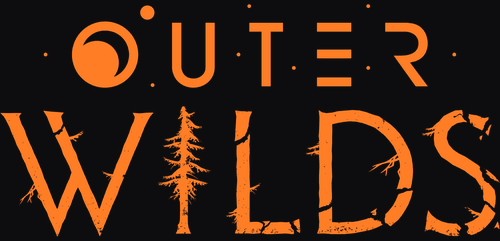

<p align="center"></p>

<h1 align="center">Outer Wilds Arabic Translation<br>الترجمة العربية للعبة Outer Wilds</h1>

<p align="center">
<a href="https://github.com/Naif-aln/Outer-Wilds-Arabic-Translation/actions/workflows/build.yml"></a>
<a href="https://github.com/Naif-aln/Outer-Wilds-Arabic-Translation/releases/latest"></a>
<a href="LICENSE"></a>
</p>

<div dir="rtl" align="right">

ترجمة عربية للعبة Outer Wilds تعمل كمود عبر [Interplanetary Polyglot](https://github.com/xen-42/outer-wilds-localization-utility). الترجمة من IHB. هذا المستودع يحتوي على **كل ما يلزم** لبناء الترجمة والمثبّت من الصفر: كود المود، ملف الترجمة، الخط، كود المثبّت، وسكربت البناء. لا يوجد أي ملف ثنائي في المستودع لا يمكنك بناؤه بنفسك.

[English version below](#english)

## التثبيت

### الطريقة الأولى: المثبّت بنقرة واحدة

1. حمّل `OWArabicTranslation_Installer.exe` من [صفحة الإصدارات](https://github.com/Naif-aln/Outer-Wilds-Arabic-Translation/releases/latest).
2. شغّله واضغط **تثبيت الترجمة**. إن لم يكن لديك Outer Wilds Mod Manager أو OWML أو Interplanetary Polyglot فسيثبّتها لك، ثم ينسخ ملفات الترجمة.
3. افتح **Outer Wilds Mod Manager** واضغط **Run Game**. إذا لم تظهر اللعبة بالعربية اختر Arabic من Options ثم Language.

قد يعرض Windows تحذير SmartScreen لأن الملف غير موقّع رقميًا. اقرأ [ماذا يفعل المثبّت بالضبط](docs/installer-behavior.md)، أو استخدم الطريقة الثانية التي لا تحتاج تشغيل أي ملف exe.

### الطريقة الثانية: يدويًا بدون exe

الخطوات الكاملة في [docs/manual-install.md](docs/manual-install.md). باختصار: ثبّت Mod Manager، ثبّت Interplanetary Polyglot من داخله، ثم ثبّت `arabic.OWArabicTranslation.zip` من صفحة الإصدارات عبر خيار Install from zip.

## لماذا يمكنك الوثوق بهذا المستودع؟

- **لا ملفات ثنائية مجهولة المصدر.** الـ exe لا يُرفع يدويًا؛ يبنيه GitHub Actions من الكود الموجود هنا عند كل إصدار، وسجل البناء لكل إصدار متاح في تبويب Actions.
- **كل إصدار يأتي مع `SHA256SUMS.txt`** لمطابقة الملفات التي حمّلتها.
- **تستطيع بناءه بنفسك** بثلاثة أوامر (انظر أدناه) ومقارنة النتيجة.
- **سلوك المثبّت موثّق بالكامل** في [docs/installer-behavior.md](docs/installer-behavior.md): أي روابط يتصل بها، وأي مجلدات يكتب فيها. لا يجمع أي بيانات ولا يلمس ملفات اللعبة.

### التحقق من ملف حمّلته

```powershell
Get-FileHash .\OWArabicTranslation_Installer.exe -Algorithm SHA256
```

قارن الناتج بالسطر المقابل في `SHA256SUMS.txt` من نفس الإصدار.

## البناء من المصدر

المتطلبات: Windows، .NET SDK 8 أو أحدث، Python 3.10 أو أحدث.

```bash
dotnet build ArabicTranslation.sln -c Release
pip install -r installer/requirements.txt
python installer/build_installer.py
```

النتائج في `installer/dist/`: المثبّت، ملف zip للمود، وملف checksums.

## بنية المستودع

| المسار | المحتوى |
|---|---|
| `ArabicTranslation/` | مود OWML: `ArabicTranslation.cs` (تشكيل الحروف العربية ومعالجة اتجاه الأسطر)، `Translation_Arabic.xml` (2424 مدخلًا مترجمًا)، `arabicfont` (حزمة خط Noto Sans Arabic)، `manifest.json` |
| `installer/installer.py` | المثبّت الرسومي (Tkinter). |
| `installer/build_installer.py` | يدمج ملفات المود والصور في المثبّت ويبني الـ exe بـ PyInstaller. |
| `installer/assets/` | صور واجهة المثبّت. النصوص العربية كصور لأن Tkinter لا يشكّل الحروف العربية. |
| `tools/ow_arabic_translator.html` | أداة مراجعة وتحرير الترجمة في المتصفح، تعمل بدون خادم. |
| `docs/` | سلوك المثبّت، الخط، التثبيت اليدوي. |
| `.github/workflows/build.yml` | البناء والإصدار الآلي. |

## المساهمة

- أخطاء الترجمة: عدّل `<value>` المقابل في `ArabicTranslation/Translation_Arabic.xml` وافتح Pull Request. اترك `<key>` كما هو.
- افتح `tools/ow_arabic_translator.html` في المتصفح لتحميل ملف XML ومراجعته سطرًا بسطر ثم تصديره.
- أي مشكلة أو اقتراح: افتح Issue.

## الشكر والتراخيص

- الترجمة: IHB.
- الكود في هذا المستودع مرخّص بـ [MIT](LICENSE). تراخيص المكونات الأخرى في [THIRD-PARTY.md](THIRD-PARTY.md).
- Interplanetary Polyglot من xen-42، وOWML وMod Manager من مجتمع ow-mods.
- ترجمة غير رسمية من المعجبين. Outer Wilds ملك لـ Mobius Digital وAnnapurna Interactive.

</div>

---

## English

An Arabic translation of Outer Wilds, delivered as an OWML mod on top of [Interplanetary Polyglot](https://github.com/xen-42/outer-wilds-localization-utility). Translation by IHB. This repository contains **everything** needed to build the translation and the installer from scratch: the mod source, the translation file, the font, the installer source and the build script. There is no binary in this repository that you cannot rebuild yourself.

### Install

**One-click installer**

1. Download `OWArabicTranslation_Installer.exe` from the [latest release](https://github.com/Naif-aln/Outer-Wilds-Arabic-Translation/releases/latest).
2. Run it and press the install button. If Outer Wilds Mod Manager, OWML or Interplanetary Polyglot are missing it installs them, then copies the translation files.
3. Open **Outer Wilds Mod Manager** and press **Run Game**. If the game is not in Arabic, pick Arabic under Options, Language.

Windows may show a SmartScreen warning because the file is not code-signed. Read [what the installer does](docs/installer-behavior.md), or use the manual route below, which never runs an executable from this project.

**Manual, no exe**

See [docs/manual-install.md](docs/manual-install.md). In short: install the Mod Manager, install Interplanetary Polyglot from it, then install `arabic.OWArabicTranslation.zip` from the Releases page with "Install from zip".

### Why you can trust this repository

- **No opaque binaries.** The `.exe` is never uploaded by hand. GitHub Actions builds it from this source on every release, and the build log for each release is visible under the Actions tab.
- **Every release ships `SHA256SUMS.txt`** so you can verify what you downloaded.
- **You can build it yourself** with three commands and compare.
- **The installer's behavior is fully documented** in [docs/installer-behavior.md](docs/installer-behavior.md): which URLs it contacts and which folders it writes. No data collection, and it never touches the game folder.

Verify a download:

```powershell
Get-FileHash .\OWArabicTranslation_Installer.exe -Algorithm SHA256
```

### Build from source

Requirements: Windows, .NET SDK 8 or newer, Python 3.10 or newer.

```bash
dotnet build ArabicTranslation.sln -c Release
pip install -r installer/requirements.txt
python installer/build_installer.py
```

Output lands in `installer/dist/`: the installer, the mod zip, and the checksum file.

### Layout

| Path | Contents |
|---|---|
| `ArabicTranslation/` | The OWML mod: `ArabicTranslation.cs` (Arabic letter shaping and line-order handling), `Translation_Arabic.xml` (2424 translated entries), `arabicfont` (Noto Sans Arabic asset bundle), `manifest.json` |
| `installer/installer.py` | The Tkinter installer. |
| `installer/build_installer.py` | Embeds the mod files and images into the installer and builds the `.exe` with PyInstaller. |
| `installer/assets/` | Installer UI images. Arabic labels are images because Tkinter cannot shape Arabic. |
| `tools/ow_arabic_translator.html` | Browser-based review and edit tool for the translation. No server needed. |
| `docs/` | Installer behavior, font, manual install. |
| `.github/workflows/build.yml` | CI build and release. |

### Contributing

- Translation fixes: edit the matching `<value>` in `ArabicTranslation/Translation_Arabic.xml` and open a pull request. Leave `<key>` untouched.
- Open `tools/ow_arabic_translator.html` in a browser to load the XML, review it entry by entry, and export.
- Problems or suggestions: open an issue.

### Credits and licenses

- Translation: IHB.
- Code in this repository is licensed under [MIT](LICENSE). Other components are listed in [THIRD-PARTY.md](THIRD-PARTY.md).
- Interplanetary Polyglot by xen-42. OWML and the Mod Manager by the ow-mods community.
- Unofficial fan translation. Outer Wilds belongs to Mobius Digital and Annapurna Interactive.
